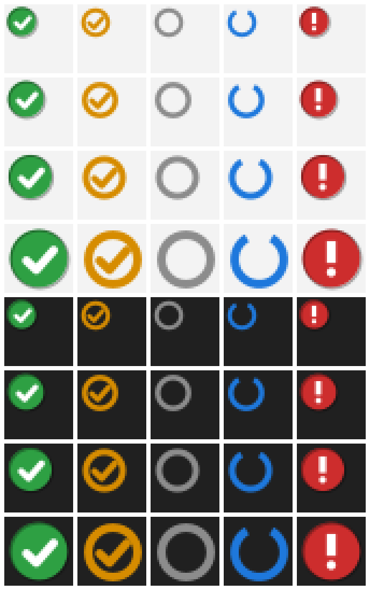

# DualConnect Tray (Stage 3)

A notification-area icon and a hotkey for moving your AirPods between this laptop and your iPhone. Press **Win+Alt+A**: if Windows has the AirPods, the tray gives them back; otherwise it brings the sound to the laptop. The icon shows which state Windows reports.

**Status: written and tested in a Linux container on 8 Oct 2026. Never run on Windows, on your laptop, or with your AirPods Pro 3 (firmware 9A348).** Every statement about behaviour on your setup below is inference unless it says otherwise.

## How it works

The tray does no Bluetooth work itself. Each switch runs the Stage 1 tool, `DualConnectW.exe` (or `DualConnect.exe`) from `stage1-tools`, with `take`, `give` or `status`, and reads its one-line JSON answer. That tool asks Windows' own Bluetooth audio driver to connect or disconnect, the same request Windows Settings makes (the ToothTray method in the Stage 2 research). See `../stage1-tools/INTERFACE.md`.

The tray adds four things around it:

- **Hotkeys** through `RegisterHotKey`, the standard Windows call for global shortcuts.
- **A live icon.** Windows' Core Audio API tells the tray when an audio device's state changes, and the tray then asks DualConnect for the current status. It also checks every 60 seconds in case an event is missed.
- **Notices for changes you didn't ask for**, such as your iPhone taking the AirPods or the case closing.
- **A log** of every switch and state change, with a 7-day summary for the Stage 3 checks.

Because this route uses Windows' own Bluetooth, the AirPods' microphone works for laptop calls whenever the AirPods are on the laptop, the same as connecting them from Settings. That closes the microphone gap the Stage 2 research flagged for the dongle route. (Inference from how Windows handles Bluetooth headsets; untested here.)

## What the icon means

Left to right:

| Icon | Meaning |
| --- | --- |
| Green disc with a tick | Windows holds the AirPods and they are the default output |
| Amber ring with a tick | Windows holds them, but sound goes to another device by default (open Sound settings from the menu) |
| Grey ring | Paired, but not on this laptop |
| Blue open ring | Switching or checking |
| Red disc with ! | Needs attention: DualConnect not found, AirPods not paired with Windows, or the last check failed. Hover for the reason |

"On this laptop" means Windows holds the AirPods' audio link. Windows cannot tell when your iPhone quietly takes the sound while that link stays up (feasibility plan, section 2), so the green icon can't promise the sound is on the laptop. If that happens, press the toggle twice, or set a separate `TakeHotkey` that always brings the sound back.

## Using it

- **Win+Alt+A** toggles. The menu shows in bold what the toggle will do next.
- **Left click** opens the menu (set `LeftClick=toggle` to switch with a click instead). **Right click** also opens it.
- Menu: *Sound to laptop*, *Give AirPods back*, *Check now*, *Sound settings*, *Bluetooth settings*, *Switch summary (last 7 days)*, *Open log folder*, *Start with Windows*, *Edit settings*, *Reload settings*, *Exit*.
- Key presses during a running switch are ignored and logged, so a double press can't queue up two switches.
- The tray never switches on its own. It acts only on your key press or menu choice.

## What it changes on your laptop

Files only, and no admin rights:

| What | Where | Undo |
| --- | --- | --- |
| The program and its settings | This folder: `DualConnectTray.exe`, `DualConnectTray.ini` | Delete them |
| Its log | `%LOCALAPPDATA%\DualConnectTray\events.csv` (rolls over at 5 MB to `events.old.csv`) | Delete the folder |
| Optional "Start with Windows" | One shortcut, `DualConnect Tray.lnk`, in your Startup folder | Untick the menu item, or delete the shortcut |

The tray writes nothing to the registry, installs no driver or service, and changes no Bluetooth or audio setting itself. Windows does keep its own list of every notification-area icon it has seen (Settings, Personalization, Taskbar, Other system tray icons); that is Windows' bookkeeping, not something the tray writes. DualConnect writes its own `actions.csv` beside itself, as its INTERFACE.md says.

### Start with Windows: why a shortcut, not the registry

The usual way to start an app at sign-in is a value under `HKCU\Software\Microsoft\Windows\CurrentVersion\Run`. The tray uses the other standard way instead: a shortcut in your own Startup folder (`%APPDATA%\Microsoft\Windows\Start Menu\Programs\Startup`). It works the same for a per-user app, and it keeps the registry untouched, which is what the project's constraints prefer.

- **Turn on:** tick *Start with Windows* in the menu. The tray creates the shortcut, pointing at this copy of `DualConnectTray.exe`.
- **Turn off (exact undo):** untick it, which deletes the shortcut. Or press Win+R, type `shell:startup`, press Enter, and delete `DualConnect Tray.lnk`.
- **One thing Windows itself may write:** if you disable the entry in Task Manager's Startup apps instead, Windows records that choice under `HKCU\Software\Microsoft\Windows\CurrentVersion\Explorer\StartupApproved\StartupFolder`. That is Windows' own setting. Re-enabling it in Task Manager, or deleting the shortcut, is the undo.
- If you move the tray's folder, untick and tick again so the shortcut points at the new place.

## Settings

`DualConnectTray.ini` is created next to the exe on first start. Edit it from the menu, then choose *Reload settings*.

| Setting | Default | Meaning |
| --- | --- | --- |
| `DualConnectPath` | empty | Path to `DualConnectW.exe` or `DualConnect.exe`. Empty: look next to the tray, then in `..\stage1-tools` |
| `DeviceName` | `AirPods` | Text the AirPods' audio device name contains (DualConnect `--name`) |
| `ToggleHotkey` | `Win+Alt+A` | Gives back if Windows has the AirPods, otherwise takes them |
| `TakeHotkey` | empty | Always brings the sound to the laptop, reconnecting if Windows already shows them connected |
| `GiveHotkey` | empty | Always gives them back |
| `LeftClick` | `menu` | `menu` or `toggle` |
| `NotifyOnOutsideChanges` | `true` | Notice when the AirPods join or leave the laptop without a switch from the tray |
| `TimeoutSeconds` | `15` | How long DualConnect waits for Windows to confirm (DualConnect `--timeout`) |
| `SafetyPollSeconds` | `60` | Extra status check interval; `0` turns it off |

Hotkeys combine Ctrl, Alt, Shift and Win with one key: A to Z, 0 to 9, F1 to F24, Space, Insert, Delete, Home, End, PageUp, PageDown or Pause. At least one of Ctrl, Alt or Win is required, so a hotkey can't swallow normal typing. If Windows or another app already owns a combination, the tray says so when it starts.

## Known limits and open questions (untested on your setup)

- **DualConnect's behaviour** on your laptop is the main unknown: whether Windows reconnects the AirPods while your iPhone holds them, and how long it takes. Stage 1's trials measure that.
- **Win+Alt+A may already be taken** on your laptop. Windows reserves many Win shortcuts, and I don't know of one on this combination, but that is not verified. The tray reports a clash at start, and you can pick another key.
- **The toggle reads Windows' view.** If Windows stays connected while the iPhone plays, the first press gives back and the second takes. A `TakeHotkey` avoids the double press.
- **Default output.** After a reconnect Windows usually makes the AirPods the default output. If it doesn't, the icon turns amber; the tray doesn't change the default itself, because the only call for that is undocumented.
- **Change notices** depend on Windows reporting the audio device's state change. The 60-second check is the fallback.
- **Left click opens the menu** through a private .NET Framework method that NotifyIcon uses for right clicks. If a future .NET update removes it, the tray falls back to showing the menu at the mouse position.
- **Calls on the iPhone.** Taking the AirPods during an iPhone call moves them away from the call. The tray only acts when you ask, so the risk is a mistaken key press.

## Building

Double-click `build.cmd`. It uses the C# compiler that ships with Windows (`%WINDIR%\Microsoft.NET\Framework64\v4.0.30319\csc.exe`), so there is nothing to install, and a program you compile yourself carries no download mark for SmartScreen to flag. The source is C# 5 for that compiler. Put this folder next to `stage1-tools` so the tray finds DualConnect without settings.

## How it was tested

| Check | Result |
| --- | --- |
| Whole app compiled as C# 5 against .NET Framework 4.8 reference assemblies (Roslyn, warnings as errors) | Passed |
| Whole app compiled with Mono's compiler | Passed |
| 22 tests of the logic that doesn't need Windows: settings, hotkey parsing, the JSON reader, state rules, the toggle, command-line quoting against Windows' rules, the log and its summary, and running a stand-in for DualConnect through success, every exit code, garbage output, a missing file and a hang | 22 passed; the tests also caught deliberately broken code |
| Icons rendered and checked by eye on light and dark backgrounds | Done (`docs/tray-icons.png`) |
| Hotkeys, tray icon, Core Audio notices, Startup shortcut, real DualConnect | **Not run.** These need Windows |

Run the tests on Linux with `tests/run-tests.sh` (needs `mono-devel` and `python3`; `dotnet-sdk-8.0` adds the Roslyn C# 5 check).

## Files

| File | What it is |
| --- | --- |
| `build.cmd` | Builds `DualConnectTray.exe` on Windows |
| `src/TrayApp.cs` | Tray icon, menu, hotkey handling, log, icons |
| `src/WinInterop.cs` | The Windows calls: hotkeys, Core Audio change notices, Startup shortcut |
| `src/DualConnectRunner.cs` | Starts DualConnect and reads its answer |
| `src/TrayCore.cs` | Settings, hotkey parsing, JSON reader, state rules, log format, summary |
| `tests/` | Linux tests, the DualConnect stand-in, and the icon renderer |
| `HANDS-ON-STEPS.md` | Your steps on the laptop for this stage |

## Removing it

Choose *Exit* in the menu. Untick *Start with Windows* first if you ticked it (or delete `DualConnect Tray.lnk` from `shell:startup`). Then delete this folder and `%LOCALAPPDATA%\DualConnectTray`.
